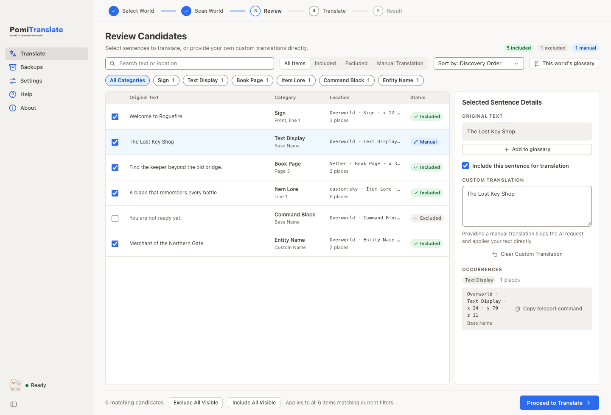
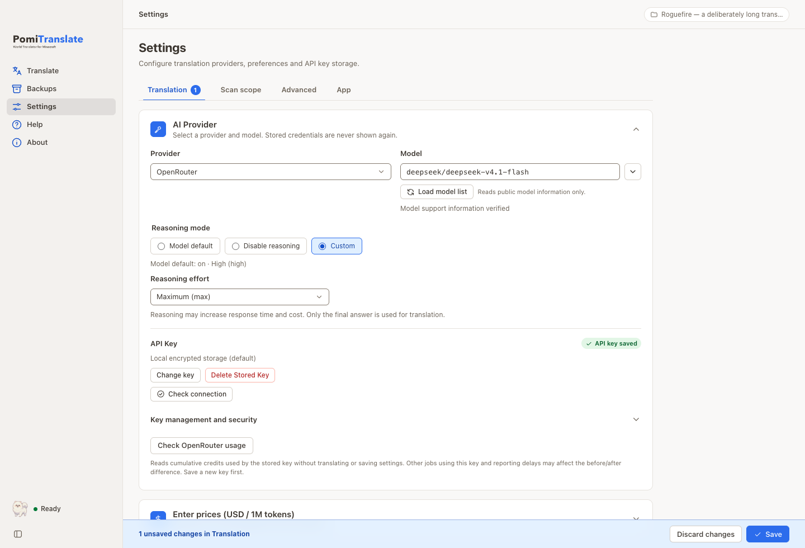
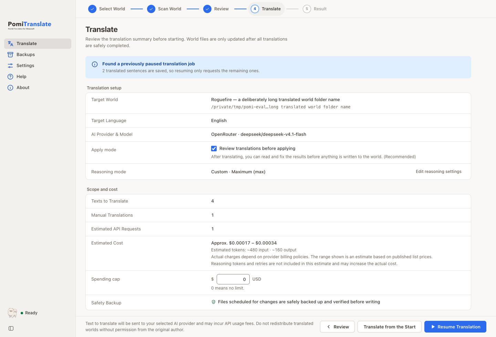

# PomiTranslate

**World Translator for Minecraft** — a desktop app that translates text in Minecraft Java Edition worlds


English | [한국어](docs/README.ko.md) | [日本語](docs/README.ja.md) | [简体中文](docs/README.zh.md)

The app interface is available in **Korean, English, Japanese and Simplified Chinese**. The **translation target language** is a separate setting and accepts your own language name.

When an adventure map greets you with signs, books and item descriptions you cannot read, PomiTranslate turns that text into a language you know. Scan the world first to see what would be translated, review the candidates, then apply your own translations or send the rest to an AI provider you choose — with a verified backup taken before anything is written.

What you can do with PomiTranslate:

- **Scan safely** — see what would be translated without changing world files or calling any API.
- **Review and edit** — search, filter, exclude strings, or enter your own translations, and keep names consistent with a glossary.
- **Translate with AI** — OpenAI, Gemini, Anthropic, OpenRouter, Comet or a custom endpoint, guided by a first-run setup assistant, with estimated request counts and a cost range before you start and an optional spending cap.
- **Check before you apply** — review and edit the translations first, retry only the failed ones, and fix them again after applying without sending new AI requests.
- **Apply with confidence** — changes are written only after a verified backup, and any earlier point can be restored.

> **In development:** the main flows have been exercised in an isolated development app on macOS Apple Silicon. Signed installers, clean-machine Windows/Linux validation and the final paid-translation workflow remain unfinished. [Current status (Korean)](docs/current-state.md) · [Follow-up work (Korean)](docs/follow-up-work.md)
>
> NOT AN OFFICIAL MINECRAFT PRODUCT. NOT APPROVED BY OR ASSOCIATED WITH MOJANG OR MICROSOFT.

## How it works

PomiTranslate reads the folder you select directly; it does not copy the world into the app. Work proceeds in six steps, and the scan, review and translation-review steps never change world files.

1. **Select a world** — open a Java Edition world folder (with level.dat) or a server root folder. The app shows the dimensions it found, the world's data format (DataVersion), an in-world resource pack and the number of stored backups. Bedrock worlds, legacy `.mcr`, `.linear` and worlds in use by a running game or server are blocked before anything starts.
2. **Scan** — find the text worth translating. This step calls no translation API and writes nothing. It summarizes unique strings, total occurrences, the estimated number of API requests and the text kinds it found, and reports unreadable chunks or unsupported formats as warnings while leaving the originals untouched.
3. **Review** — search, sort and filter candidates by kind or state. Exclude strings you do not want translated, or type your own translation for a string. A sentence used in several places is translated once and applied everywhere.
4. **Run** — check the target world, translation language, provider and model, the number of strings to send, the estimated request count and cost range, an optional spending cap, and the safety backup, then start. The run shows its progress with the remaining time and the most recent translations, and stops at the cap if you set one. World files stay untouched while it translates.
5. **Review and apply** — by default, the translations open in a review screen before anything is written. Edit a translation (formatting codes are validated), retry only the failed ones, then apply to the world after a verified backup. After applying, **Edit translations** restores that job's backup and reapplies the saved translations plus your edits without sending any AI request.
6. **Result and restore** — review changed files, translated/failed/kept strings, tokens used and reported cost. If you want to undo the run, restore any backup point from Backups; the state right before a restore is kept as a recovery snapshot.

## Screenshots

### Reviewing candidates



Search and filter by kind or state, exclude strings, or enter your own translation. You can also see where the same source text appears. Formatting codes such as `§` and placeholders such as `%s` or `{0}` are preserved so the game still renders them.

### Provider, model and reasoning



OpenRouter and Gemini reasoning can follow the **model default**, be **turned off** when supported, or use a **custom effort**. Model support lookup is separate from saving settings, and the save/discard bar stays pinned at the bottom.

<details>
<summary>Pre-run summary</summary>



</details>

The screenshots show the **English interface** of the current Svelte UI, captured in Chromium with **synthetic data**. Korean and Japanese guides show their corresponding interfaces. The models, worlds and costs are illustrative; screenshots do not prove actual usage, native installation or model support. [Capture details and all languages](docs/images/README.md)

## Features

### Scan and review

- Inspect candidates and coverage before anything is translated or written.
- Search, sort (world order, source text, frequency, kind), filter by kind or state, and include or exclude in bulk.
- See every occurrence of a string and enter manual translations. If you only apply manual translations, no translation API request is needed.
- Skip text already written in the target language to avoid paying for re-translation.
- Readable locations (dimension and coordinates), a copyable teleport command, a right-click or keyboard context menu, and undo for bulk include/exclude.
- A scan home summary shows the last scan, the last translation and a card to continue an interrupted job.

### Glossary

- Keep a global glossary and a per-world glossary of terms to always translate a given way or to leave untranslated. Import and export JSON or CSV, or add a term from a candidate in one click.
- Only the terms that appear in a batch are sent with its request. If an answer breaks a rule, the app asks once more with a reminder and otherwise flags the sentence for review.
- Glossaries live in app data, never in the world folder. Changing the glossary after translating refreshes only the affected sentences before you apply.

### Providers and models

- Configure OpenAI, Gemini, Anthropic, OpenRouter, Comet or a Custom endpoint (OpenAI/Anthropic-compatible wire formats). Available models depend on your provider and account.
- Look up model lists and, when pricing is known, the price per million tokens. OpenRouter's public catalog is fetched automatically, and this lookup does not save settings.
- Choose OpenRouter or Gemini reasoning as model default, off, or a supported effort. Models that require reasoning cannot be turned off, and an unsupported effort cannot be saved.
- Set up everything in a first-run assistant: pick a provider (with a link to its key page), paste the key to check the connection automatically (the typed key is used for that one request and not stored until you save), choose a recommended model with its price, and set the target language and style.
- Set the target language and a style preset (neutral, casual, formal, polite, story or a custom system prompt), plus extra instructions. The style-brief helper is a separate AI request and may cost money.
- When the catalog has no price for a model, enter your own input and output prices and the estimate uses them.
- Settings are split into Translation, Scan scope, Advanced and App tabs; the save bar appears only for changes that need saving, and file/key rules and manual translations have chip and table editors.

### Review, apply and cost control

- By default, translations open in a review screen before the world is written. Edit any row (formatting codes and placeholders are validated), see why a sentence failed in plain language, and retry only the failed ones.
- After applying, **Edit translations** restores the job's backup and reapplies the cached translations plus your edits, with no AI requests and with crash-safe recovery.
- Set a spending cap in USD: the app warns if the estimated maximum exceeds it, and a run that reaches the cap stops before writing and can be continued later. Estimates include reasoning and glossary allowances.
- Progress shows the remaining time and recent translations, and an optional OS notification tells you when a long job finishes in the background.

### Safe writes and restore

- Changed files are stored in a verified backup before writing, and the state right before a restore is kept as a recovery snapshot.
- If the world changed after the scan, the fingerprint no longer matches and writing is refused. If the game or server is using the world, the session.lock conflict stops the write.
- Paths that point outside the selected world and symlinked resource packs are blocked before reading or sending anything to an API.
- Cancelling or failing keeps already translated strings, so a retry only asks for what is left. A provider outage leaves world files completely unchanged.
- Unreadable chunks are preserved as-is and reported in the result.

### Resource pack ZIPs

- Optionally translate language files in the in-world `resources.zip` and in up to 16 external ZIPs you select explicitly.
- External ZIPs are backed up before changes, and a restore requires selecting the same ZIP again in Settings. Folder-style packs are not supported yet.

### Keys and privacy

- Desktop credentials default to a **local encrypted SQLite vault plus a separate key file**. Session-only and OS-keychain modes are optional.
- Saved keys are never shown again in the UI and are not included in public settings JSON or world backups.
- The OS keychain is accessed only when you press the import button; the app does not read it automatically at startup.

### Desktop experience

- A Tauri 2 + Svelte 5 shell with a Python core; the desktop app opens no localhost server for its UI.
- Korean, English, Japanese and Simplified Chinese UI, with system, light and dark themes. The View menu zooms the interface from 75% to 200%.
- Feels like a desktop app: unified macOS title bar, fixed sidebar and toolbar with only the content scrolling, menu shortcuts (`Cmd/Ctrl+O` open world, `Cmd+,` settings, `Cmd/Ctrl+F` find), drag a world folder onto the window, a list of worlds from your Minecraft saves folders (with icons), Dock/taskbar progress, quit protection while a job runs, a prompt before closing with unsaved settings, and a remembered window size and position.
- Command blocks: `tellraw`/`title` text is read in both JSON and Java 1.21.5+ SNBT form; only changed strings are rewritten in their original quoting, and unreadable commands are kept and reported.
- A CLI built on the same core. Keys saved in the desktop app and the CLI's keyring/environment variables are not shared automatically.

## Usage

1. Close Minecraft or the server and make an independent **copy of the world**.
2. On first launch, follow the setup assistant (or open Settings) to choose the provider, model and target language, and add any translation instructions. When using AI translation, enter and save your own API key.
3. In **Select world → Scan**, open the copy and read the coverage and warnings.
4. In **Review**, exclude strings and enter manual translations.
5. In **Run**, check the target, reasoning, external transfer, estimated cost and spending cap, then start.
6. In the translation review, fix any translations, retry failed ones and apply to the world. You can still edit translations after applying.
7. Review the **Result** and verify the text in game. To undo, restore from **Backups**.

Cost estimates can differ from the actual bill. Retries, account or routing differences and reporting delays are not captured by the estimate, so check your provider dashboard as well. The [user guide](docs/user-guide.en.md) covers settings, restore and CLI usage in more detail.

### Running from source

Development builds are the current reference; there is no signed installer and not every OS has been validated. Running from source needs Python 3.12, Node.js 22.12 or newer, pnpm 12.6.0, a Rust toolchain and the [Tauri platform prerequisites](https://v2.tauri.app/start/prerequisites/).

```bash
git clone https://github.com/kim0040/PomiTranslate.git
cd PomiTranslate
python3.12 -m venv .venv
source .venv/bin/activate
python -m pip install -r requirements.txt pyinstaller==6.16.0
pnpm install --frozen-lockfile
pnpm desktop:dev
```

The activation command above is for macOS/Linux. Windows commands, toolchain versions and packaging are in the [development guide (Korean)](docs/development.md); contribution steps are in [CONTRIBUTING.md](CONTRIBUTING.md). The packaged design embeds a Python sidecar, but clean-machine installation has not been validated yet.

## Support scope

PomiTranslate handles signs, book pages and titles (including filtered titles), entity and block names, item names and lore, text displays, command text components and ZIP resource-pack language files. Verified compression formats are gzip, zlib, none, LZ4 and external `.mcc`. Support is based on **synthetic fixtures**: a passing row means that shape is read and written correctly, not that every text in every Minecraft version, mod or world will be found.

The scan covers the `region` and `entities` folders of each dimension, the in-world `resources.zip`, and external ZIPs selected explicitly on desktop. Data packs, scoreboards, command storage, `level.dat` text, player data and folder-style resource packs are outside the current scope. Bedrock, `.mcr`, `.linear` and unknown compression are never written. [Support matrix (Korean)](docs/support-matrix.md)

## Costs, data and disclaimer

The app itself has no purchase, subscription or in-app payment. **AI API usage may cost you money under your provider's terms.** The text you choose to translate and your translation instructions are sent to the API provider or relay service you select. Check each provider's retention, training and privacy policies.

Desktop credentials default to a **local encrypted SQLite vault plus a separate key file**; session-only and OS-keychain modes are optional. This does not protect against processes that can read both files under your user account. [Data and key handling](docs/privacy.en.md)

The software is provided **AS IS**, without guarantees of translation accuracy, compatibility with every world, data preservation or uninterrupted use. To the extent permitted by applicable law, the author and contributors accept no liability for data loss, world corruption, API charges or other damage arising from use. See the [full disclaimer and rights notice](docs/disclaimer.en.md) and the [MIT license text](LICENSE).

Third-party rights in maps, resource packs and translations are separate from the software license. Do not redistribute translated content without the original creator's permission.

## Development and verification status

The main flows — world selection, scan, review, run, result and restore — have been exercised in a macOS Apple Silicon development app, and synthetic fixtures check reading and writing per format. Earlier implementation records include relevant frontend, browser, Rust and provider Python checks and an unsigned debug app bundle; those records have their own source and environment scopes. Limited real OpenRouter and DeepSeek translation runs have been verified on synthetic data, including writes and hash-matched restore. These checks do not establish all-provider pricing or translation quality, and the latest native UI checks remain pending.

The Phase 2 desktop-feature and macOS arm64 development-environment gate is complete, and Phase 3 is in progress; the project is not release-ready. Signing, notarization and the updater, clean-machine Windows/Linux installation, macOS Intel and native validation of the OS-keychain opt-in remain. Exact check scopes and remaining gates are tracked in [Current status (Korean)](docs/current-state.md) and [Follow-up work (Korean)](docs/follow-up-work.md).

## Contributor and contact

- **김현민 / Hyunmin Kim** — creator and maintainer · [mini0227kim@gmail.com](mailto:mini0227kim@gmail.com)
- Bugs and suggestions: [GitHub Issues](https://github.com/kim0040/PomiTranslate/issues)
- Contributing: [CONTRIBUTING.md](CONTRIBUTING.md)

PomiTranslate began as a personal project by a university student who wanted to translate his own Minecraft worlds, and it is maintained in personal time with a limited budget. It is not a commercial service or a paid support product. As a work in progress, some features may be incomplete or rough around the edges — please check the support scope and warnings, keep your own backups, and use it with that in mind. See the [full disclaimer and rights notice](docs/disclaimer.en.md).

When reporting a bug, include your OS, app version and reproduction steps. Do not post API keys, private worlds or logs containing secrets in a public issue. No response schedule, fix timeline or financial compensation is promised.

## License and documentation

The project source keeps its existing **[MIT License](LICENSE)**. Dependencies keep their own licenses and are not relicensed by the project's MIT. No obvious conflict with keeping MIT was found in the reviewed scope, but per-artifact notices and full platform dependency verification must be completed before a final binary release. [Third-party notices](THIRD_PARTY_NOTICES.md)

[Documentation index (Korean)](docs/README.md) · [Current status (Korean)](docs/current-state.md) · [Follow-up work (Korean)](docs/follow-up-work.md)
