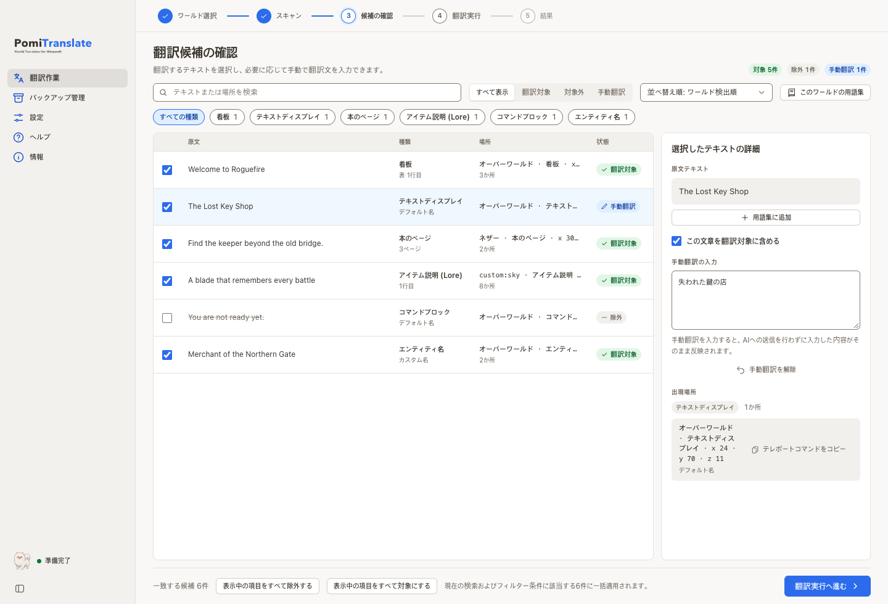
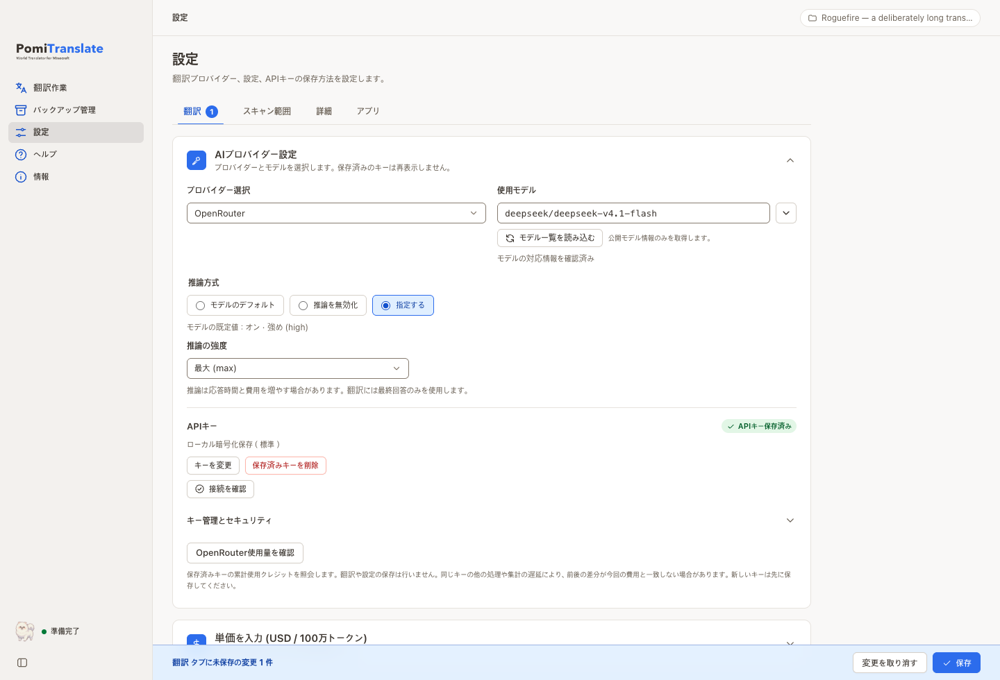
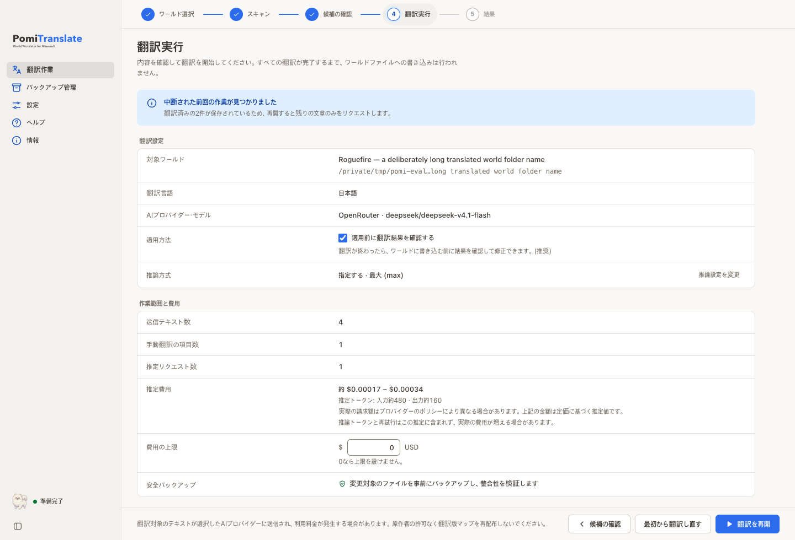

# PomiTranslate

**World Translator for Minecraft** — Minecraft Java Edition のワールド内テキストを翻訳するデスクトップアプリ

[English](../README.md) | [한국어](README.ko.md) | 日本語 | [简体中文](README.zh.md)

アプリの表示言語は**韓国語・英語・日本語・簡体字中国語**です。**翻訳先言語**は UI 言語とは別の設定で、任意の言語名を入力できます。

アドベンチャーマップの看板や本、アイテム説明が読めずに困ったとき、PomiTranslate はワールド内のテキストを読みたい言語に翻訳します。まずワールドをスキャンして翻訳候補を確認し、候補を見直してから、自分で訳文を入力するか、選んだ AI プロバイダーに残りの翻訳を依頼できます。ワールドに書き込む前には検証済みバックアップを作成します。

PomiTranslate でできること:

- **安全にスキャン** — ワールドファイルを変更せず、API も呼び出さずに翻訳候補を確認できます。
- **確認・編集** — 候補を検索・絞り込み、翻訳対象から外したり、自分の訳文を入力したりでき、用語集で訳語をそろえられます。
- **AI 翻訳** — OpenAI、Gemini、Anthropic、OpenRouter、Comet、カスタム endpoint に対応します。初回起動時は設定アシスタントが案内し、開始前に予想リクエスト数と費用の範囲を表示して、費用の上限も設定できます。
- **適用前の確認** — 翻訳結果を先に確認・修正し、失敗した文だけを翻訳し直せます。適用後も AI リクエストなしで訳文を修正できます。
- **確認して適用** — 検証済みバックアップを作成してから変更を書き込み、必要なら以前の状態に復元できます。

> **開発中:** macOS Apple Silicon の隔離された開発アプリで主要な流れを確認しています。署名済みインストーラー、Windows/Linux のクリーン環境での検証、実際に料金が発生する翻訳ワークフローの最終確認は未完了です。[現在の状況（韓国語）](current-state.md) · [今後の作業（韓国語）](follow-up-work.md)
>
> NOT AN OFFICIAL MINECRAFT PRODUCT. NOT APPROVED BY OR ASSOCIATED WITH MOJANG OR MICROSOFT.
>
> Minecraft 公式製品ではありません。Mojang または Microsoft による承認・提携を受けていません。

## 動作の流れ

PomiTranslate は選択したフォルダーを直接読み取り、ワールドをアプリ内にコピーしません。作業は次の 6 段階です。スキャン、候補確認、翻訳結果の確認ではワールドファイルを変更しません。

1. **ワールドを選択** — <code>level.dat</code> を含む Java Edition のワールドフォルダー、またはサーバーのルートフォルダーを開きます。検出したディメンション、データ形式（DataVersion）、ワールド内蔵リソースパック、保存済みバックアップ数を表示します。Bedrock、旧形式の <code>.mcr</code>、<code>.linear</code>、ゲームやサーバーが使用中のワールドは開始前にブロックします。
2. **スキャン** — 翻訳候補を探します。この段階では翻訳 API を呼び出さず、何も書き込みません。重複を除いた文字列数、出現回数、予想 API リクエスト数、検出したテキストの種類をまとめます。読み取れないチャンクや未対応形式は警告として報告し、元のまま残します。
3. **候補を確認** — 候補を検索・並べ替え、種類や状態で絞り込みます。翻訳しない文字列を除外したり、訳文を直接入力したりできます。同じ原文が複数の場所にある場合は一度だけ翻訳し、すべての場所に適用します。
4. **翻訳を実行** — 対象ワールド、翻訳先言語、プロバイダーとモデル、送信する文字列数、予想リクエスト数と費用の範囲、任意の費用上限、安全バックアップを確認してから開始します。進行画面には残り時間と最近の翻訳が表示され、上限を設定している場合はその時点で停止します。翻訳中はワールドファイルに書き込みません。
5. **確認して適用** — 既定では、書き込みの前に翻訳結果の確認画面が開きます。訳文を修正し（書式コードを検証します）、失敗した文だけを翻訳し直し、検証済みバックアップの後でワールドに適用します。適用後も「翻訳文を修正」で、そのジョブのバックアップを復元し、保存済みの翻訳と修正内容を AI リクエストなしで再適用できます。
6. **結果と復元** — 変更ファイル数、翻訳・失敗・原文維持の文字列、使用トークンと報告された費用を確認します。元に戻す場合は「バックアップ管理」から任意の時点を復元できます。復元直前の状態も復旧用スナップショットとして保存します。

## スクリーンショット

### 翻訳候補の確認

サイドバーの「翻訳作業」から候補を開き、検索や種類・状態フィルターを使って確認できます。翻訳対象から外したり、訳文を直接入力したりでき、同じ原文の使用箇所も見られます。§ 書式コードや %s、{0} などのプレースホルダーはゲームで正しく表示されるよう保持します。

### プロバイダーとモデルの設定

サイドバーの「設定」では、OpenRouter と Gemini の推論方式を、モデルが既定で使う設定に任せる、対応している場合に無効にする、または強度を「指定する」方法から選べます。画面上の選択肢は「モデルのデフォルト / 推論を無効化 / 指定する」です。モデル対応情報の取得と設定の保存は別操作で、保存・変更取り消しの領域は画面下部に固定されています。

翻訳開始前の確認画面

スクリーンショットは現在の UI を **合成データ** で実行して撮影しました。表示されるモデル、ワールド、費用は説明用の例であり、実際の利用状況や特定モデルへの対応を示すものではありません。[撮影情報（一部韓国語）](images/README.md)

## 主な機能

### スキャンと候補確認

- 翻訳や書き込みを始める前に候補とスキャン範囲を確認できます。
- 検索、並べ替え（ワールド順、原文順、出現頻度順、種類別）、種類・状態フィルター、一括の対象化・除外を利用できます。
- 各文字列の出現場所を確認して訳文を入力できます。手動訳だけを適用する場合、翻訳 API のリクエストは不要です。
- 翻訳先言語ですでに書かれたテキストをスキップし、再翻訳の費用を抑えられます。
- 読みやすい場所表示（ディメンションと座標）、テレポートコマンドのコピー、右クリックとキーボードのメニュー、一括の対象化・除外の取り消しに対応します。
- スキャン画面で最近のスキャンと最近の翻訳の概要、続行できる作業のカードを確認できます。

### 用語集

- すべてのワールド用とワールドごとの用語集で、常に決まった訳にする語や訳さない語を指定できます。JSON・CSV でインポート・エクスポートでき、候補からすぐに追加できます。
- 翻訳リクエストには、そのまとまりに出てくる語だけを含めます。回答がルールと違う場合は一度だけリマインダー付きで依頼し、それでも違えば確認対象として表示します。
- 用語集はワールドフォルダーではなくアプリのデータに保存します。翻訳後に用語集を変更した場合は、適用前に影響を受ける文だけを翻訳し直します。

### プロバイダーとモデル

- OpenAI、Gemini、Anthropic、OpenRouter、Comet、カスタム endpoint（OpenAI/Anthropic 互換の wire format）を設定できます。利用できるモデルはプロバイダーとアカウントによって異なります。
- モデル一覧と、価格情報がある場合は 100 万トークンあたりの単価を確認できます。OpenRouter の公開カタログは自動取得されます。この照会では設定を保存しません。
- OpenRouter と Gemini の推論方式はモデルのデフォルト、無効、対応する強度から選べます。推論が必須のモデルでは無効にできず、未対応の強度は保存できません。
- 初回起動の設定アシスタントで、プロバイダー（キー発行ページへのリンク付き）を選び、キーを貼り付けて接続を自動確認し（入力したキーはそのリクエストだけに使い、保存するまで保管しません）、価格が見えるおすすめモデルと翻訳先言語・文体を設定します。
- 翻訳先言語と文体（標準、カジュアル、フォーマル、丁寧、物語風、カスタム system prompt）を設定し、追加指示を加えられます。文体メモの補助機能は別の AI リクエストを送るため、費用が発生する場合があります。
- カタログに単価がないモデルは、入力・出力単価を自分で入力すると費用の推定に使われます。
- 設定は「翻訳」「スキャン範囲」「詳細」「アプリ」のタブに分かれ、保存領域は保存が必要な変更があるときだけ表示されます。ファイル・キーの規則と保存する手動翻訳は、チップと表のエディターで扱います。

### 確認・適用と費用の管理

- 既定では、ワールドに書き込む前に翻訳結果の確認画面が開きます。行を修正し（書式コードとプレースホルダーを検証します）、失敗の理由をわかりやすい文章で確認し、失敗した文だけを翻訳し直せます。
- 適用後の「翻訳文を修正」は、そのジョブのバックアップを復元し、保存済みの翻訳と修正内容を再適用します。AI リクエストは送らず、途中で止まっても復旧できる設計です。
- USD の費用上限を設定すると、推定の最大費用が超える場合に警告し、実行中に上限へ達すると書き込む前に停止して、後で続行できます。推定には推論と用語集の余裕分が含まれます。
- 進行画面には残り時間と最近の翻訳が表示され、長い作業がバックグラウンドで終わったときは、設定に応じて OS の通知でお知らせします。

### 安全な書き込みと復元

- 変更するファイルを検証済みバックアップとして保存してから書き込みます。復元直前の状態も復旧用スナップショットに保存します。
- スキャン後にワールドが変更され、フィンガープリントが一致しない場合は書き込みを拒否します。ゲームやサーバーがワールドを使用中の場合も <code>session.lock</code> の競合で書き込みを中止します。
- 選択したワールドの外を指すパスや、シンボリックリンクのリソースパックは、読み取りや API 送信の前にブロックします。
- キャンセルや失敗のあとも完了済みの翻訳は保存され、残りから再開できます。プロバイダーの障害で失敗した場合、ワールドファイルは変更されません。
- 読み取れないチャンクは元のまま保持し、結果に報告します。

### リソースパック ZIP

- ワールド内の <code>resources.zip</code> と、明示的に選択した外部 ZIP（最大 16 個）の言語ファイルを任意で翻訳できます。
- 外部 ZIP は変更前にバックアップします。復元時には設定で同じ ZIP をもう一度選択してください。フォルダー形式のパックにはまだ対応していません。

### キーとプライバシー

- デスクトップ版の API キーは、既定で **ローカルの暗号化 SQLite と別ファイルのキー** に保存します。セッションのみの保存と OS キーチェーンは任意で選べます。
- 保存したキーは画面に再表示せず、公開設定 JSON やワールドバックアップにも含めません。
- OS キーチェーンにアクセスするのはユーザーがインポートボタンを押したときだけです。起動時に自動で読み取りません。

### デスクトップアプリ

- Tauri 2 + Svelte 5 の画面と Python コアを使います。UI 用の localhost サーバーは起動しません。
- UI は韓国語・英語・日本語・簡体字中国語に対応し、システム・ライト・ダークの各テーマを使えます。「表示」メニューでは 75〜200% に拡大できます。
- macOS の統合タイトルバー、固定サイドバーとツールバー（スクロールするのはコンテンツ部分）、メニューのショートカット（<code>Cmd/Ctrl+O</code> でワールドを開く、<code>Cmd+,</code> で設定、<code>Cmd/Ctrl+F</code> で検索）、ワールドフォルダーのドラッグ＆ドロップ、Minecraft の saves フォルダーからのワールド一覧（アイコン付き）、Dock・タスクバーの進捗表示、作業中の終了防止、未保存の設定がある場合の終了確認、ウィンドウのサイズと位置の記憶に対応します。
- コマンドブロックの <code>tellraw</code> / <code>title</code> テキストは JSON 形式と Java 1.21.5 以降の SNBT 形式で読み取ります。変更した文字列だけを元の引用符の形式で書き戻し、解釈できないコマンドは保持して報告します。
- 同じコアを使う CLI もあります。デスクトップアプリに保存したキーは、CLI の keyring や環境変数とは自動で共有されません。

## 使い方

1. Minecraft またはサーバーを終了し、ワールドの**独立したコピー**を作ります。
2. 初回起動時は設定アシスタント（または「設定」）で、プロバイダー、モデル、翻訳先言語、必要な翻訳指示を選びます。AI 翻訳を使う場合は自分の API キーを入力して保存します。
3. 「ワールド選択 → スキャン」でコピーを開き、対象範囲と警告を確認します。
4. 「翻訳作業 → 翻訳候補の確認」で翻訳しない文字列を除外し、必要なら手動訳を入力します。
5. 「翻訳の準備と実行」で対象、推論、外部送信、予想費用、費用上限を確認して開始します。
6. 翻訳結果の確認で訳文を修正し、失敗した文を翻訳し直してから、ワールドに適用します。適用後も訳文を修正できます。
7. 結果を確認してゲーム内でテキストを確かめます。元に戻す場合は「バックアップ管理」から復元します。

費用の推定値は実際の請求額と異なることがあります。推論トークン、再試行、モデルのルーティング費用は含まれないため、プロバイダーのダッシュボードも確認してください。[ユーザーガイド](user-guide.ja.md)では設定、復元、CLI の詳しい使い方を説明しています。

### ソースから実行する

現在は開発ビルドを基準に案内しています。署名済みインストーラーはなく、すべての OS での検証も完了していません。ソースから実行するには Python 3.12、Node.js 22.12 以上、pnpm 12.6.0、Rust toolchain と [Tauri のプラットフォーム要件](https://v2.tauri.app/start/prerequisites/)が必要です。

~~~bash
git clone https://github.com/kim0040/PomiTranslate.git
cd PomiTranslate
python3.12 -m venv .venv
source .venv/bin/activate
python -m pip install -r requirements.txt pyinstaller==6.16.0
pnpm install --frozen-lockfile
pnpm desktop:dev
~~~

上記の仮想環境を有効にするコマンドは macOS/Linux 向けです。Windows のコマンド、toolchain のバージョン、パッケージングは[開発ガイド（韓国語）](development.md)に、貢献方法は [CONTRIBUTING.md（韓国語）](../CONTRIBUTING.md) にあります。パッケージには Python sidecar を含める設計ですが、クリーンな環境でのインストール検証はまだ完了していません。

## 対応範囲

看板、本のページとタイトル（フィルタリング済みのタイトルを含む）、エンティティ名とブロック名、アイテム名と説明、テキストディスプレイ、コマンドテキストコンポーネント、ZIP リソースパックの言語ファイルを扱います。検証済みの圧縮形式は gzip、zlib、無圧縮、LZ4、外部 <code>.mcc</code> です。対応の根拠は**合成フィクスチャ**であり、すべての Minecraft バージョン、MOD、ワールドから必ずテキストを見つけられることを示すものではありません。

スキャンするのは各ディメンションの <code>region</code> と <code>entities</code> フォルダー、ワールド内の <code>resources.zip</code>、デスクトップ版で明示的に選択した外部 ZIP です。データパック、スコアボード、コマンドストレージ、<code>level.dat</code> のテキスト、プレイヤーデータ、フォルダー形式のリソースパックは現在の対象外です。Bedrock、<code>.mcr</code>、<code>.linear</code>、未知の圧縮形式には書き込みません。[対応表（韓国語）](support-matrix.md)

## 費用、データ、免責

アプリ自体に購入費、サブスクリプション、アプリ内課金はありません。**AI API の利用には、選択したプロバイダーの条件に従って料金が発生する場合があります。** 翻訳対象のテキストと翻訳指示は、選択した API プロバイダーまたは中継サービスに送信されます。各プロバイダーの保存、学習、プライバシーに関する方針を確認してください。

デスクトップ版の API キーは既定で**ローカルの暗号化 SQLite と別ファイルのキー**に保存します。セッションのみの保存と OS キーチェーンも任意で選べます。同じユーザーアカウントのもとで両方のファイルを読めるプロセスからは保護されません。[データとキーの取り扱い](privacy.ja.md)

本ソフトウェアは **AS IS** で提供され、翻訳の正確さ、すべてのワールドとの互換性、データ保全、中断のない利用を保証しません。適用法で認められる範囲で、作者と貢献者はデータ損失、ワールド破損、API 利用料、その他の損害について責任を負いません。[免責と権利に関する全文](disclaimer.ja.md)と [MIT ライセンス](../LICENSE)を確認してください。

マップ、リソースパック、翻訳コンテンツの第三者の権利は、ソフトウェアのライセンスとは別です。原作者の許可なく翻訳コンテンツを再配布しないでください。

日本語の安全案内

翻訳前にワールドをバックアップしてください。PomiTranslate は選択したワールドのファイルに直接書き込みます。

翻訳対象のテキストは選択した API プロバイダーに送信され、利用料が発生する場合があります。

PomiTranslate 自体に購入費、サブスクリプション、アプリ内課金はありません。

## 開発・検証状況

macOS Apple Silicon の開発アプリで、ワールド選択、スキャン、候補確認、翻訳実行、結果、復元という主要な流れを確認しています。形式ごとの読み書きは合成フィクスチャで検査しています。合成ワールドを使った限定的な OpenRouter/DeepSeek 実測では、Python JSONL/core 経由で 3 件を翻訳する 1 回の有料リクエスト、書き込み、再読込、バックアップからの復元を行い、復元後のワールド全体の SHA-256 が元の値に戻ることを確認しました。プロバイダーが報告した費用はアプリの推定上限を超えました。この結果は最新の native UI 経由の一連の動作、すべてのプロバイダーの価格精度、翻訳品質を示すものではありません。費用の数値と検証範囲は[DeepSeek 検証記録（韓国語）](history/deepseek-api-verification-2026-10-02.md)を参照してください。

Phase 2 のデスクトップ機能と macOS arm64 開発環境の gate は完了し、Phase 3 は進行中です。プロジェクトはまだ release-ready ではありません。署名、notarization、updater、Windows/Linux のクリーン環境でのインストール、macOS Intel、OS キーチェーンの opt-in 機能の native 検証が残っています。検査範囲と残作業は[現在の状況（韓国語）](current-state.md)と[今後の作業（韓国語）](follow-up-work.md)で確認できます。

## 作者・連絡先

- **김현민 / Hyunmin Kim** — 制作者・メンテナー · [mini0227kim@gmail.com](mailto:mini0227kim@gmail.com)
- バグ報告・提案: [GitHub Issues](https://github.com/kim0040/PomiTranslate/issues)
- 貢献方法: [CONTRIBUTING.md（韓国語）](../CONTRIBUTING.md)

PomiTranslate は、自分の Minecraft ワールドを翻訳したいと考えた大学生が始めた個人プロジェクトです。現在も個人の時間と限られた予算で保守しています。企業による商用サービスでも、有料サポート製品でもありません。開発中のため、一部の機能が未完成だったり、使い勝手に改善の余地があったりします。対応範囲と警告を確認し、大切なワールドはご自身でバックアップしてご利用ください。[免責と権利について](disclaimer.ja.md)

不具合の報告には OS、アプリのバージョン、再現手順を記載してください。API キー、個人のワールド、秘密情報を含むログを公開 Issue に投稿しないでください。回答時期、修正時期、金銭的補償は約束していません。

## ライセンス・ドキュメント

プロジェクトのソースコードには既存の **[MIT License](../LICENSE)** を適用しています。依存ソフトウェアはそれぞれのライセンスに従い、プロジェクトの MIT ライセンスで再許諾されるものではありません。確認した範囲では MIT を維持することとの明らかな衝突は見つかっていませんが、正式なバイナリ配布の前に、配布物ごとの告知と全プラットフォームの依存関係確認を完了する必要があります。[第三者ライセンス告知（韓国語）](../THIRD_PARTY_NOTICES.md)

[ドキュメント一覧（韓国語）](README.md) · [現在の状況（韓国語）](current-state.md) · [今後の作業（韓国語）](follow-up-work.md)
