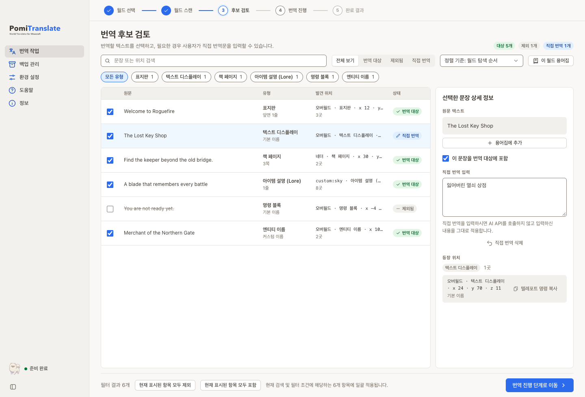
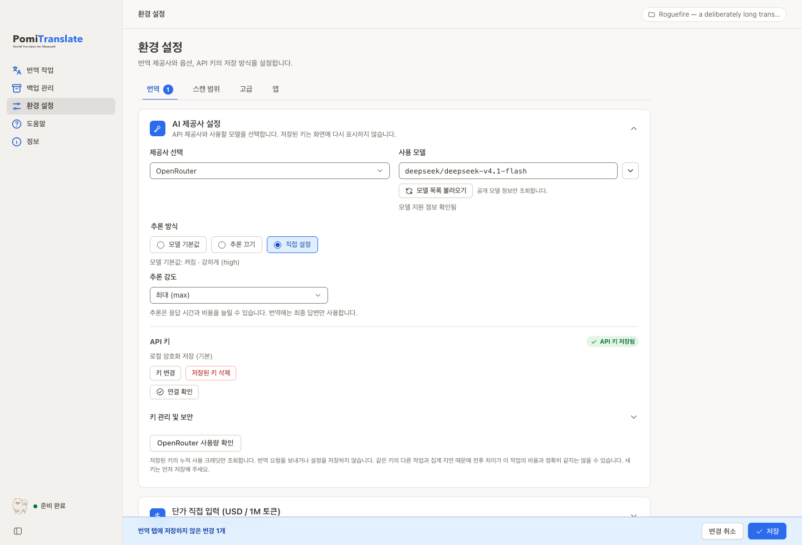
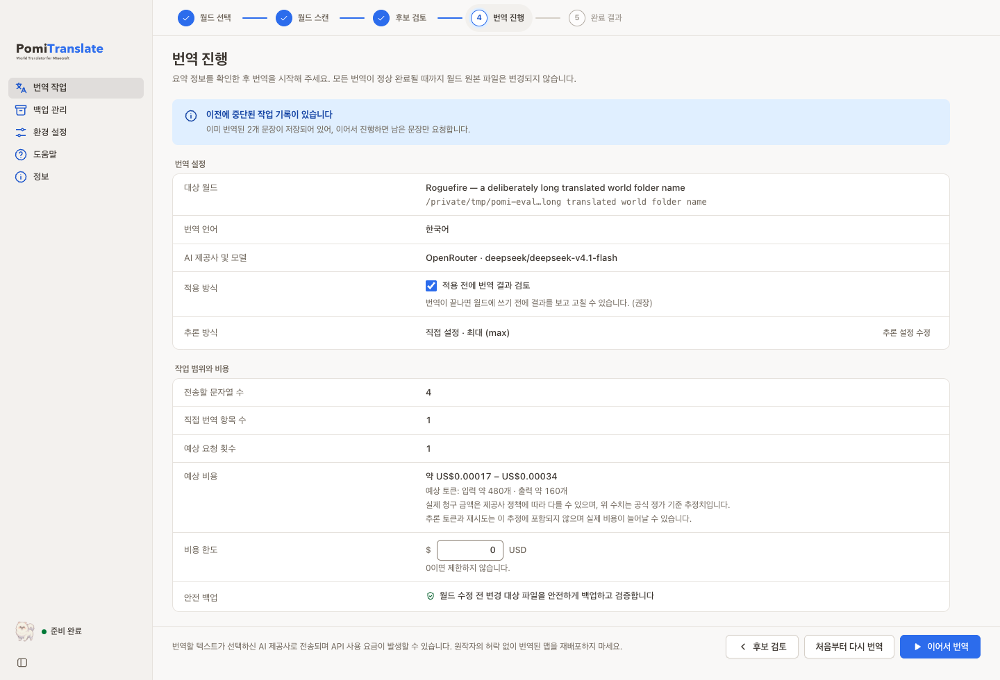

# PomiTranslate

**World Translator for Minecraft** — 마인크래프트 Java Edition 월드의 텍스트를 번역하는 데스크톱 앱


[English](../README.md) | 한국어 | [日本語](README.ja.md) | [简体中文](README.zh.md)

앱 표시 언어는 **한국어·영어·일본어·중국어 간체**입니다. **번역 도착 언어**는 UI 언어와 별도로 원하는 언어명을 입력할 수 있습니다.

해외 어드벤처 맵을 플레이하다 보면 표지판과 책, 아이템 설명이 읽히지 않아 흐름이 끊길 때가 있습니다. PomiTranslate는 그 텍스트를 원하는 언어로 바꿔 주는 데스크톱 앱입니다. 월드를 먼저 스캔해 번역할 문장을 확인하고, 필요한 문장만 골라 직접 번역하거나 선택한 AI 제공사로 번역한 다음, 검증된 백업과 함께 월드에 적용합니다.

PomiTranslate로 할 수 있는 일:

- **안전한 스캔** — 월드 파일을 바꾸거나 API를 호출하지 않고 번역 대상을 먼저 확인합니다.
- **검토와 직접 편집** — 검색·필터로 후보를 추리고, 제외하거나 직접 번역문을 입력하며, 용어집으로 이름을 일관되게 번역합니다.
- **AI 번역** — OpenAI, Gemini, Anthropic, OpenRouter, Comet, Custom endpoint를 지원합니다. 처음 실행하면 설정 도우미가 안내하고, 실행 전 예상 요청 수와 비용 범위를 보여 주며 비용 한도도 정할 수 있습니다.
- **적용 전 확인** — 번역 결과를 먼저 검토·수정하고 실패한 문장만 다시 번역하며, 적용한 뒤에도 AI 요청 없이 번역문을 고칠 수 있습니다.
- **백업과 복원** — 검증된 백업 뒤에만 쓰고, 원하는 시점으로 되돌릴 수 있습니다.

> **개발 중:** macOS Apple Silicon의 격리된 개발 앱에서 주요 흐름을 확인했습니다. 서명된 정식 설치본, Windows/Linux 실기 검증, 실제 유료 번역의 최종 검증은 남아 있습니다. [현재 상태](current-state.md) · [추후 작업](follow-up-work.md)
>
> NOT AN OFFICIAL MINECRAFT PRODUCT. NOT APPROVED BY OR ASSOCIATED WITH MOJANG OR MICROSOFT.

## 어떻게 동작하나요

PomiTranslate는 월드를 앱 안으로 복사하지 않고 선택한 폴더를 직접 읽습니다. 작업은 여섯 단계로 진행되며, 스캔·검토·번역 결과 검토 단계에서는 월드 파일이 전혀 바뀌지 않습니다.

1. **월드 선택** — Java Edition 월드 폴더(level.dat 포함)나 서버 루트 폴더를 엽니다. 차원 구성, 데이터 형식(DataVersion), 월드 내장 리소스팩, 보존 중인 백업 수를 보여 줍니다. Bedrock, 구형 `.mcr`, `.linear`, 게임이나 서버가 사용 중인 월드는 시작 전에 차단합니다.
2. **스캔** — 번역할 문장을 찾습니다. 이 단계는 번역 API를 호출하지 않고 월드 파일도 수정하지 않습니다. 고유 문자열 수, 전체 등장 위치, 예상 API 요청 수, 텍스트 유형을 요약합니다. 읽을 수 없는 청크나 지원하지 않는 형식은 원본을 그대로 둔 채 경고로 알립니다.
3. **검토** — 검색, 정렬, 유형·상태 필터로 후보를 살펴봅니다. 번역에서 제외할 문장을 고르고, 원하는 문장에는 직접 번역문을 입력할 수 있습니다. 같은 원문이 여러 위치에 쓰이면 한 번만 번역해 모든 위치에 적용합니다.
4. **실행** — 대상 월드, 번역 언어, 제공사와 모델, 전송할 문자열 수, 예상 요청 횟수와 비용 범위, 선택한 비용 한도, 안전 백업 여부를 확인한 뒤 시작합니다. 진행 화면은 남은 시간과 최근 번역을 보여 주고, 한도를 정했다면 한도에서 멈춥니다. 번역하는 동안 월드 원본 파일은 변경되지 않습니다.
5. **검토 후 적용** — 기본값에서는 월드에 쓰기 전에 번역 결과 검토 화면이 열립니다. 번역문을 고치고(서식 코드 검증), 실패한 문장만 다시 번역한 다음, 검증된 백업 뒤에 월드에 적용합니다. 적용한 뒤에도 **번역문 수정**으로 그 작업의 백업을 복원하고, 저장된 번역과 수정한 내용을 AI 요청 없이 다시 적용할 수 있습니다.
6. **결과와 복원** — 변경된 파일 수, 번역·실패·원문 유지 문장, 사용한 토큰과 실제 청구 비용을 확인합니다. 되돌리려면 백업 관리에서 원하는 시점으로 복원합니다. 복원 직전 상태도 안전 스냅샷으로 남습니다.

## 화면

### 번역할 문장을 직접 검토



검색과 유형·상태 필터로 문장을 찾고, 번역에서 제외하거나 직접 번역문을 입력할 수 있습니다. 같은 원문이 어디에 쓰였는지도 함께 확인합니다. `§` 서식 코드와 `%s`, `{0}` 같은 자리표시자는 게임 안에서 그대로 표시되도록 유지합니다.

### 모델과 추론 방식 설정



OpenRouter 추론은 **모델 기본값 / 추론 끄기 / 직접 설정** 중에서 고릅니다. 모델 지원 정보 조회와 설정 저장을 분리했고, 화면 아래에는 저장·변경 취소 영역을 고정했습니다.

<details>
<summary>실행 전 확인 화면</summary>



</details>

화면은 현재 Svelte 제품 UI의 **한국어 화면**을 Chromium에서 **합성 데이터**로 실행해 캡처했습니다. 영어·일본어 문서는 각각 해당 UI 언어의 화면을 사용합니다. 네이티브 설치 검증은 아닙니다. 표시된 모델·월드·비용은 소개용 예시이며 실제 사용량이나 해당 모델의 지원 보장이 아닙니다. [화면 정보](images/README.md)

## 주요 기능

### 스캔과 검토

- 월드를 수정하거나 번역 API를 호출하지 않고 후보와 지원 범위를 먼저 확인합니다.
- 명령 블록 `tellraw`/`title`의 JSON 형식과 Java 1.21.5+ SNBT 형식을 모두 읽고, 바뀐 문자열만 원래 형식대로 씁니다. 해석할 수 없는 명령은 원본 유지 + 경고로 알립니다.
- 검색, 정렬(월드 순서·원문순·빈도순·유형별), 유형·상태 필터와 일괄 포함/제외를 제공합니다.
- 문장별 등장 위치를 확인하고 직접 번역문을 입력할 수 있습니다. 직접 번역만 적용하면 번역 API 요청이 필요하지 않습니다.
- 이미 도착 언어로 작성된 텍스트를 건너뛰어 재번역 비용을 줄일 수 있습니다.
- 읽기 쉬운 위치 표시(차원·좌표), 텔레포트 명령 복사, 오른쪽 클릭·키보드 메뉴, 일괄 포함/제외 되돌리기를 제공합니다.
- 스캔 화면에서 최근 스캔·최근 번역 요약과 이어서 할 작업 카드를 볼 수 있습니다.

### 용어집

- 모든 월드용 용어집과 월드별 용어집으로, 항상 정해진 대로 번역하거나 번역하지 않을 용어를 지정합니다. JSON·CSV로 가져오고 내보내며 후보에서 바로 추가할 수 있습니다.
- 번역 요청에는 그 묶음에 나오는 용어만 포함합니다. 답이 규칙과 다르면 한 번 더 요청해 상기시키고, 그래도 다르면 검토 대상으로 표시합니다.
- 용어집은 월드 폴더가 아니라 앱 데이터에 저장합니다. 번역 후 용어집을 바꾸면 적용 전에 영향받는 문장만 다시 번역합니다.

### 제공사와 모델

- OpenAI, Gemini, Anthropic, OpenRouter, Comet과 Custom endpoint(OpenAI/Anthropic 호환 규격)를 설정할 수 있습니다. 사용 가능한 모델은 제공사와 계정에 따라 다릅니다.
- 모델 목록을 조회하고, 단가 정보가 있으면 100만 토큰당 가격을 보여 줍니다. OpenRouter는 공개 catalog를 자동으로 조회하며, 이 조회는 설정을 저장하지 않습니다.
- OpenRouter·Gemini 추론은 모델 기본값, 끄기, 직접 강도 지정 중에서 선택합니다. 추론을 끌 수 없는 모델이나 지원하지 않는 강도는 저장할 수 없습니다. Gemini의 사고(thinking) 토큰도 사용량에 포함해 보여 줍니다.
- 첫 실행 설정 도우미에서 제공사(키 발급 페이지 링크 포함)를 고르고, 키를 붙여 넣어 연결을 자동으로 확인하며(입력한 키는 그 요청에만 쓰고 저장하기 전에는 보관하지 않음), 가격이 보이는 추천 모델과 도착 언어·문체를 정합니다.
- 도착 언어와 문체(표준·친근·격식·존댓말·이야기풍·사용자 지정)를 설정하고 추가 지시문을 덧붙일 수 있습니다. 지시문 다듬기는 별도 AI 요청이므로 비용이 발생할 수 있습니다.
- 목록에 단가가 없는 모델은 입력·출력 단가를 직접 입력하면 비용 추정에 사용합니다.
- 환경 설정은 번역·스캔 범위·고급·앱 탭으로 나뉘고, 저장 영역은 저장이 필요한 변경이 있을 때만 나타납니다. 파일·키 규칙과 저장형 수동 번역은 칩·표 편집기로 다룹니다.

### 검토·적용과 비용 관리

- 기본값에서는 월드에 쓰기 전에 번역 결과 검토 화면이 열립니다. 행을 고치고(서식 코드·자리표시자 검증), 실패 이유를 읽기 쉬운 문장으로 확인하며, 실패한 문장만 다시 번역할 수 있습니다.
- 적용한 뒤 **번역문 수정**은 그 작업의 백업을 복원하고 저장된 번역과 수정한 내용을 다시 적용합니다. AI 요청을 보내지 않으며 중간에 멈춰도 복구할 수 있게 설계했습니다.
- USD 비용 한도를 정하면 예상 최대 비용이 넘을 때 경고하고, 실행 중 한도에 닿으면 월드에 쓰기 전에 멈춰 나중에 이어서 할 수 있습니다. 추정에는 추론·용어집 여유분이 포함됩니다.
- 진행 화면은 남은 시간과 최근 번역을 보여 주며, 긴 작업이 백그라운드에서 끝나면 선택에 따라 운영체제 알림을 보냅니다.

### 안전한 쓰기와 복원

- 쓰기 전에 변경 대상 파일을 검증된 백업으로 보관하고, 복원 직전 상태도 recovery snapshot으로 남깁니다.
- 스캔 이후 월드가 바뀌면 지문(fingerprint)이 달라져 쓰기를 거부합니다. 게임이나 서버가 월드를 사용 중이면 session.lock 충돌로 쓰기를 중단합니다.
- 월드 밖을 가리키는 경로와 심볼릭 링크 리소스팩은 읽기와 API 전송 전에 차단합니다.
- 취소하거나 실패해도 이미 번역된 문장은 저장해 두고 남은 문장만 이어서 번역합니다. 제공사 장애로 실패하면 월드 파일은 전혀 바뀌지 않습니다.
- 읽을 수 없는 청크는 원본 그대로 유지하고 결과에 보고합니다.

### 리소스팩 ZIP

- 옵션으로 월드 내 `resources.zip`과 직접 선택한 외부 ZIP(최대 16개)의 언어 파일을 처리합니다.
- 외부 ZIP도 변경 전 백업하며, 복원할 때는 설정에서 같은 ZIP을 다시 선택해야 합니다. 폴더형 팩은 아직 지원하지 않습니다.

### 키와 개인정보

- API 키의 기본 저장 방식은 **로컬 암호화 SQLite + 별도 key 파일**입니다. 세션 전용과 OS 키체인은 선택 사항입니다.
- 저장된 키는 화면에 다시 표시하지 않으며, 공개 설정 JSON과 월드 백업에 포함되지 않습니다.
- OS 키체인은 사용자가 가져오기를 누를 때만 접근하고, 앱 시작 시 자동으로 읽지 않습니다.

### 데스크톱 경험

- Tauri 2 + Svelte 5 화면과 Python 코어를 사용하며, UI용 localhost 서버를 열지 않습니다.
- UI 언어는 한국어·영어·일본어·중국어 간체이고, 시스템·라이트·다크 테마를 지원합니다. 보기 메뉴에서 75–200%까지 확대할 수 있습니다.
- 데스크톱 앱다운 동작: macOS 통합 타이틀바, 고정 사이드바·툴바와 내용만 스크롤되는 창, 메뉴 단축키(`Cmd/Ctrl+O` 월드 열기, `Cmd+,` 설정, `Cmd/Ctrl+F` 찾기), 월드 폴더 끌어다 놓기, Minecraft saves 폴더의 월드 목록(아이콘 포함), Dock·작업 표시줄 진행률, 작업 중 종료 보호, 저장하지 않은 설정이 있을 때 닫기 확인, 창 크기·위치 기억.
- 같은 코어를 쓰는 CLI를 함께 제공합니다. 데스크톱에 저장한 키와 CLI의 keyring/환경변수는 자동으로 공유되지 않습니다.

## 사용 방법

1. Minecraft 또는 서버를 종료하고 **월드의 별도 복사본**을 만듭니다.
2. 처음 실행하면 설정 도우미(또는 **환경 설정**)에서 제공사, 모델, 도착 언어와 필요한 번역 지시를 설정합니다. AI 번역을 사용할 때는 본인의 API 키를 입력해 저장합니다.
3. **월드 선택 → 월드 스캔**에서 복사본을 선택하고, 지원 범위와 경고를 확인합니다.
4. **후보 검토**에서 제외할 문장과 직접 번역문을 지정합니다.
5. **번역 진행**에서 대상·추론·외부 전송·예상 비용·비용 한도를 확인한 뒤 실행합니다.
6. 번역 결과 검토에서 번역문을 고치고 실패한 문장을 다시 번역한 다음 월드에 적용합니다. 적용한 뒤에도 번역문을 수정할 수 있습니다.
7. **완료 결과**를 확인하고 게임에서 내용을 검토합니다. 되돌리려면 **백업 관리**에서 복원을 선택합니다.

추정 비용은 실제 청구 금액과 다를 수 있습니다. 재시도, 계정·라우팅 차이와 제공사 집계 지연은 추정에 반영되지 않으므로 제공사 대시보드도 함께 확인하세요. 자세한 설정·복원·CLI 안내는 [사용 안내](user-guide.md)에 있습니다.

### 실행·설치

현재는 개발 빌드를 기준으로 안내합니다. 정식 서명 설치본이나 모든 OS 지원이 완료됐다고 소개하지 않습니다. 소스 실행에는 Python 3.12, Node.js 22.12 이상, pnpm 12.6.0, Rust toolchain과 [Tauri 플랫폼 준비 항목](https://v2.tauri.app/start/prerequisites/)이 필요합니다.

```bash
git clone https://github.com/kim0040/PomiTranslate.git
cd PomiTranslate
python3.12 -m venv .venv
source .venv/bin/activate
python -m pip install -r requirements.txt pyinstaller==6.16.0
pnpm install --frozen-lockfile
pnpm desktop:dev
```

위 가상환경 활성화는 macOS/Linux 예시입니다. Windows 명령, toolchain 버전과 패키징은 [개발 안내](development.md)를, 기여 방법은 [CONTRIBUTING.md](../CONTRIBUTING.md)를 따릅니다. 완성된 패키지는 Python sidecar를 포함하는 구조지만, clean-machine 설치 검증은 아직 남아 있습니다.

## 지원 범위

표지판, 책 페이지와 제목(필터링된 제목 포함), 엔티티·블록 이름, 아이템 이름과 설명, 텍스트 디스플레이, 명령 텍스트 컴포넌트와 ZIP 리소스팩 언어 파일을 처리합니다. 압축은 gzip, zlib, 무압축, LZ4와 외부 `.mcc`를 검증했습니다. 검증한 **합성 형식**을 기준으로 하며 모든 Minecraft 버전·모드·월드의 텍스트를 찾는다는 뜻은 아닙니다.

스캔 대상은 각 차원의 `region`/`entities` 폴더, 월드 안의 `resources.zip`, 데스크톱에서 직접 선택한 외부 ZIP입니다. 데이터팩, scoreboard, command storage, `level.dat`의 텍스트, playerdata, 폴더형 리소스팩은 현재 범위에 포함되지 않습니다. Bedrock, `.mcr`, `.linear`, 알 수 없는 압축에는 쓰지 않습니다. [지원 표](support-matrix.md)

## 비용·개인정보·면책

앱 자체의 구매·구독·인앱 결제는 없습니다. **AI API 이용료는 선택한 제공사의 정책에 따라 사용자에게 발생할 수 있습니다.** 번역할 텍스트와 번역 지시는 선택한 API 제공사 또는 중계 서비스로 전송됩니다. 제공사별 보관·학습·개인정보 정책도 확인하세요.

API 키의 데스크톱 기본 저장 방식은 **로컬 암호화 SQLite + 별도 key 파일**입니다. 세션 전용과 OS 키체인은 선택 사항입니다. 같은 사용자 계정에서 두 파일을 모두 읽을 수 있는 프로세스까지 막는 보안은 아닙니다. [데이터·키 안내](privacy.md)

이 소프트웨어는 **있는 그대로(AS IS)** 제공됩니다. 번역 정확도, 모든 월드와의 호환성, 데이터 보존, 중단 없는 이용을 보증하지 않습니다. 적용 법률이 허용하는 범위에서 작성자·기여자는 데이터 손실, 월드 손상, API 청구 및 사용으로 발생하는 손해에 책임을 부담하지 않습니다. [면책·권리 안내 전문](disclaimer.md)과 [MIT 원문](../LICENSE)을 확인하세요.

맵·리소스팩·번역본의 제3자 권리는 소프트웨어 라이선스와 별개입니다. 원작자의 허락 없이 재배포하지 마세요.

## 개발과 검증 상태

macOS Apple Silicon 개발 앱에서 월드 선택부터 스캔·검토·실행·결과·복원까지 주요 흐름을 확인했고, 합성 fixture로 형식별 읽기·쓰기를 검사합니다. 기존 구현 기록에는 관련 frontend·browser·Rust 및 provider Python 검사와 unsigned debug 앱 번들이 있으며, 각 기록의 소스·환경 범위를 따릅니다. 합성 데이터의 제한된 실제 OpenRouter·DeepSeek 번역과 쓰기·hash 일치 복원을 확인했습니다. 모든 제공사의 가격·번역 품질 검증이나 최신 네이티브 UI 검증을 뜻하지는 않습니다.

Phase 2 데스크톱 기능·macOS arm64 개발 환경 gate는 완료됐고 Phase 3가 진행 중이며, release-ready는 아닙니다. 서명·notarization·updater, Windows/Linux clean-machine 설치, macOS Intel, OS 키체인 opt-in의 native 검증은 남아 있습니다. 정확한 검사 범위와 잔여 gate는 [현재 상태](current-state.md)와 [추후 작업](follow-up-work.md)에서 관리합니다.

## 기여자·문의

- **김현민** — 제작·유지보수 · [mini0227kim@gmail.com](mailto:mini0227kim@gmail.com)
- 버그·제안: [GitHub Issues](https://github.com/kim0040/PomiTranslate/issues)
- 기여: [CONTRIBUTING.md](../CONTRIBUTING.md)

PomiTranslate는 대학생 김현민이 본인의 Minecraft 월드를 번역하려고 시작한 개인 프로젝트입니다. 지금도 개인 시간과 제한된 예산으로 유지하고 있으며, 기업이 운영하는 상용 서비스나 유료 지원 상품이 아닙니다. 아직 개발 중이라 일부 기능이 미완성이거나 예상치 못한 문제가 있을 수 있습니다. 사용 전에 지원 범위와 경고를 확인하고, 중요한 월드는 직접 백업해 주세요. [면책·권리 안내 전문](disclaimer.md)

버그 보고에는 OS, 앱 버전, 재현 방법을 적어 주세요. API 키, 개인 월드, 비밀이 포함된 로그를 공개 Issue에 올리지 마세요. 답변·수정 일정이나 금전 보상을 약속하는 지원 서비스는 제공하지 않습니다.

## 라이선스·문서

프로젝트 소스는 기존 **[MIT License](../LICENSE)**를 유지합니다. 의존성은 각각의 라이선스를 따르며 프로젝트 MIT로 다시 허가되는 것이 아닙니다. 검토한 범위에서 MIT 유지의 명백한 충돌은 발견하지 않았지만, 배포물별 고지·전체 플랫폼 의존성 검증은 정식 배포 전에 완료해야 합니다. [제3자 고지](../THIRD_PARTY_NOTICES.md)

[문서 목차](README.md) · [현재 상태](current-state.md) · [추후 작업](follow-up-work.md)
